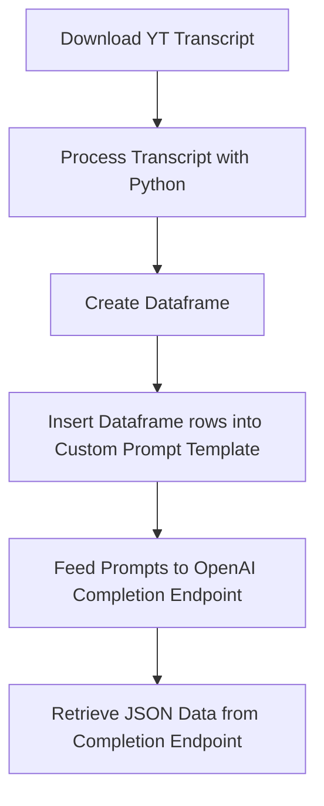

## Overall Process

```mermaid
flowchart TD
A[Download YT Transcript]
A --> C[Process Transcript with Python]
C --> D[Create Dataframe]
D --> E[Insert Dataframe rows into Custom Prompt Template]
E --> F[Feed Prompts to OpenAI Completion Endpoint]
F --> G[Retrieve JSON Data from Completion Endpoint]
```
